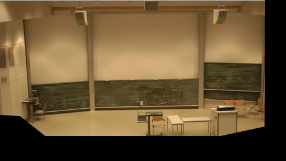

# Configuration Properties

**cv.lecturesight.framesource.input.mrl**
*Default:* v4l:///dev/video0[width=320;height=240]

MRL (media resource locator) of the video input from the overview camera that is served by the FrameSourceProvider. The MRL must have the following form:

`type :// path [options]`

with

<table>
<tr><td>type</td><td>the type of the input, determines which input plugin is used</td></tr>
<tr><td>path</td><td>path to the input, usually a linux device or file</td></tr>
<tr><td>options</td><td>additional arguments for the input plugin</td></tr>
</table>

For example, the default value for this property tells the system to use the Video4Linux device `/dev/video0` as the overview source with QVGA resolution.

**cv.lecturesight.framesource.input.mask**
*Default:* none

The path to the input mask image file for masking the input provided by the \textit{FrameSourceProvider}. The masking is deactivated if value is `none`. Otherwise the provided mask image is laoded when the framesource is activated and the mask is applied to each input frame before it is made availabel to consuming services: Each pixel in the input frame is set to black if the first component of the color value of the corresponding pixel in the mask image equals 0.

The following constraints apply to mask image files:

* the file format must be either PNG or JPEG
* the dimensions of the mask image must be at leat those of the video input
* for a masking pixel the first component of the color value must equal 0

